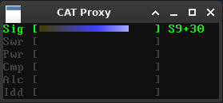
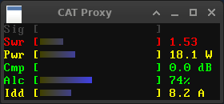

# CAT Proxy – display meters when using CAT-enabled transceiver

## The problem

When using a program that talks to the radio via the CAT (Computer Aided Tuning) interface, like WSJT-X, normally you have to rely on this program to show various measurements taken by the radio, like signal level or SWR value. It's because the program has sole control of the radio's CAT interface.

CAT Proxy aims to solve this issue.

Note that it's currently a Linux-only solution (although it might work with or without minor modifications on other UNIX-like systems too).

## The solution

CAT Proxy works by putting itself between the program and the radio, and periodically halting transmissions from the program to issue a series of commands to read radio meters. In this state any data from the radio that's not a response to the meter query is forwarded to the program, but responses to meter queries are intercepted by CAT Proxy and processed.

Data from radio meters is then interpreted and presented in several ways, like X11 window with bargraps. More about these ways in *Outputs*.





There's a limitation to this method – if the program reads meters on its own, then CAT Proxy might get confused and intercept a response to the query made by the program. Please don't use CAT Proxy with programs that already read radio meters.

## Key concepts

To understand how the program works and how to configure it, you have to understand a few key concepts and names I chose to refer to them.

### Port

It's the character device (like a serial port, or USB-emulated serial port) you normally configure in your program to talk to the radio. In case of my FT-891, two devices are created – `/dev/ttyUSB0` and `/dev/ttyUSB1` (but numbers may vary!). One is for CAT and one is for PTT control with DTR or RTS lines.

With the following udev rule I fixed them to appear as `/dev/ttyFTCAT` and `/dev/ttyFTPTT`:

```
ATTRS{idVendor}=="10c4", ATTRS{idProduct}=="ea70", ENV{ID_USB_INTERFACE_NUM}=="00", SUBSYSTEM=="tty", SYMLINK+="ttyFTCAT"
ATTRS{idVendor}=="10c4", ATTRS{idProduct}=="ea70", ENV{ID_USB_INTERFACE_NUM}=="01", SUBSYSTEM=="tty", SYMLINK+="ttyFTPTT"
```

Then I can talk to my radio using `/dev/ttyFTCAT` – and if that's your port too, then you should configure this port (`port.device` setting) in CAT Proxy.

Serial ports need different communication parameters to be set and matched on both ends (computer program and the radio) for the communication to work. It's baudrate (speed), number of data bits, number of stop bits, parity, and flow control mechanism.

CAT Proxy allows only baudrate to be configured, and it has to match the baudrate configured on your radio (unless the radio uses direct serial emulation, in which case it might be irrelevant; in case of FT-891, which has a dedicated chip and a physical UART inside, it has to match).

Other parameters are fixed: 8 data bits, 1 stop bit, no parity, no flow control. It's because it's the most common configuration. If your radio needs different configuration then please let me know and I'll add possibility to configure these parameters to CAT Proxy.

### PTY

If CAT Proxy is occupying the serial port, then how can your program of choice connect to the radio? That's where the PTY (pseudoterminal) concept becomes useful. CAT Proxy creates a pseudoterminal device for your program to connect to, and creates a symlink to it, so it's always in the same place.

You just specify the PTY symlink name in CAT Proxy's configuration file (`pty.symlink` setting, which defaults to `~/.catproxy.tty`), put it instead of your normal radio port in your program's configuration, and as long as CAT Proxy is running, it should work.

### Model

As different radio models have different meters, possibly different commands to read them, different meter ranges, etc., a concept of a *model* has been introduced. A *model*, in CAT Proxy, is just a part of the program that handles reading meters and converting raw values read from the radio to meaningful values for the user (for example, power in watts, current drain in amps, signal strength in S-meter values).

As I only have Yaesu FT-891, I wrote only the FT-891 model, but CAT Proxy is prepared to easily add new radio models. If it ever becomes popular and if I have users willing to do the testing (or, even better, some development), other models might be added as well.

Note that not all meters are available all the time. In my FT-891 implementation meter availability is dependent on the current radio mode (RX or TX). In RX mode, only signal meter is available. In TX mode, it's SWR, output power, output stage current drain (Idd), compressor level, and ALC. Mode is determined from the Idd value (it's 0 in RX).

### Output

Once we have data from the meters, it has to be presented somehow. Here the concept of *output* becomes handy. It's just a way to present data. Currently only two outputs are available – *x11* (an X11 window with colorful meters and graphs), and *table* (a table that's periodically sent to stdout, for piping to another program if anyone ever needs this).

A possible idea might be, for example, to run the program on a Raspberry Pi, with a big color display connected to its GPIO pins, and present meters there. Another idea might be to send meter values over the network, or publish them with MQTT. Possibilities here are endless, they only depend on one's needs.

#### x11 output quirks

In case of `x11` output, SWR meter can have a different color depending on the SWR level. It's because this meter is, at least to me, the most important one, and I want to have an instant visual cue if anything goes wrong with the antenna, tuner, etc.

Window can be resized horizontally (it will make bargraphs longer), but can't be resized vertically. If you need it to be bigger and more readable, consider changing `output.x11.scale` configuration setting.

## Building and installation

First you need to install prerequisites. This command should do the job on Debian-like systems:

`apt-get install g++ scons libx11-dev libinih-dev`

Once installed, run `scons` and the program should be built. `sudo scons install` should install the binary called `catproxy` in `/usr/local/bin`.

## Command line interface

The program accepts only a few command line options. The rest is specified in the configuration file.

There's obviously `-h` to show help. Other than that, there's `-d` to enable debug output on stderr, 
`-l` to list supported models (and their meters) and outputs, and `-c` to specify alternate configuration 
file location.

## Configuration

In a `doc` directory there's a file `catproxy.conf.example` with example configuration – a configuration file template. You should modify this file and put it in `~/.catproxy.conf` (a default location), or another location that you'll have to specify with `-c`.

You can configure almost everything in CAT Proxy with this file. Example file is heavily commented, so 
I won't duplicate these comments here.

## Usage

Just run `catproxy` without arguments and it should (in the case of `x11` output) create a screen with 
meters – or show an error, for example that it can't connect to the radio.

If the radio is connected, then CAT Proxy will start polling its meters right away. This way you're not 
forced to use another program and proxy CAT traffic through CAT Proxy. Once your program connects to CAT 
Proxy, it will silently start forwarding traffic from it to the radio.

Everything is designed to be as easy to set up as possible.

## Signals

CAT Proxy supports two non-standard signals: `SIGUSR1` will enable debugging output (like `-d` command line switch), and `SIGUSR2` will disable it. It might be useful to debug the already-running program if it misbehaves.

## Disclaimer

Note that the program normally shows most current meters and, in case of CAT timeout, shows all meters greyed out, but if anything goes wrong and the program freezes, you might get stale readings and if you rely on them, then you might fry your radio (for example when transmitting into a broken antenna, when SWR is very high, but the program still shows some old value).

Also note that I did my best to come up with accurate conversions of raw meters values to meaningful, human-readable ones, but bugs can happen everywhere.

Always be mindful of what you're doing and if anything goes wrong, please don't hold me accountable (but, of course, please let me know!).

## TODO

The program is in its very early stage, not even alpha, so bugs are to be expected. If you find any, please let me know. Other than that, there are several things I'd like to possibly see in the program in the future. Here's the list.

* Add other radio models, as needed
* Add radio model `test` for testing bargraph colors
* Add possibility to disable certain meters even if the model supports them
* Add more flexibility to the bargraph color editing
* Add configurable peak point to the bargraph
* Add the ability to filter CAT commands (for example if the program stubbornly attempts to change some setting in the radio you don't want it to touch). If you need this, you can always do a quick hack – see `Proxy::feedFromPty` in `proxy.cpp`
* When testing CAT Proxy without the external program connected, I noticed that responses from the radio forwarded to the program are sometimes echoed back by the PTY. I didn't spend too much time on this, but it might be worth investigating
* Maybe beautify the X11 output somewhat. It's colorful, but otherwise crude. I'll need a visual artist for that…
* Grey out all meters in case of CAT timeout

## Contact

To report issues, please use the GitHub issue tracker. With other things, please contact me at circuitchaos (at) interia.com
